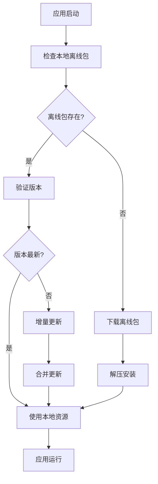

# 离线包技术

## 概述

离线包是一种将应用的静态资源（HTML、CSS、JavaScript、图片等）打包并预先下载到本地的技术方案。它能够显著提升应用的加载速度，减少网络请求，提供更好的用户体验，特别是在弱网络环境下。

## 核心原理

### 1. 离线包架构



### 2. 版本管理

```javascript
// 版本管理器
class VersionManager {
  constructor() {
    this.currentVersion = null;
    this.latestVersion = null;
    this.versionStorage = localStorage;
  }
  
  // 获取当前版本
  getCurrentVersion() {
    return this.versionStorage.getItem('offline_package_version') || '0.0.0';
  }
  
  // 检查远程版本
  async checkLatestVersion() {
    try {
      const response = await fetch('/api/version');
      const data = await response.json();
      this.latestVersion = data.version;
      return this.latestVersion;
    } catch (error) {
      console.error('检查版本失败:', error);
      return null;
    }
  }
  
  // 比较版本
  compareVersions(version1, version2) {
    const v1Parts = version1.split('.').map(Number);
    const v2Parts = version2.split('.').map(Number);
    
    for (let i = 0; i < Math.max(v1Parts.length, v2Parts.length); i++) {
      const v1Part = v1Parts[i] || 0;
      const v2Part = v2Parts[i] || 0;
      
      if (v1Part > v2Part) return 1;
      if (v1Part < v2Part) return -1;
    }
    return 0;
  }
  
  // 是否需要更新
  needsUpdate() {
    const current = this.getCurrentVersion();
    const latest = this.latestVersion;
    
    if (!latest) return false;
    
    return this.compareVersions(current, latest) < 0;
  }
}
```

## 离线包下载与管理

### 1. 下载器实现

```javascript
// 离线包下载器
class PackageDownloader {
  constructor() {
    this.downloadQueue = [];
    this.isDownloading = false;
    this.retryCount = 0;
    this.maxRetries = 3;
  }
  
  // 下载离线包
  async downloadPackage(packageInfo) {
    const { url, version, hash } = packageInfo;
    
    try {
      this.isDownloading = true;
      
      // 显示下载进度
      this.showDownloadProgress(0);
      
      const response = await fetch(url);
      if (!response.ok) {
        throw new Error(`下载失败: ${response.status}`);
      }
      
      const contentLength = response.headers.get('content-length');
      const total = parseInt(contentLength, 10);
      let loaded = 0;
      
      const reader = response.body.getReader();
      const chunks = [];
      
      while (true) {
        const { done, value } = await reader.read();
        
        if (done) break;
        
        chunks.push(value);
        loaded += value.length;
        
        // 更新进度
        const progress = (loaded / total) * 100;
        this.showDownloadProgress(progress);
      }
      
      const blob = new Blob(chunks);
      const arrayBuffer = await blob.arrayBuffer();
      
      // 验证文件完整性
      if (hash && !await this.verifyHash(arrayBuffer, hash)) {
        throw new Error('文件校验失败');
      }
      
      // 保存到本地
      await this.savePackage(arrayBuffer, version);
      
      this.hideDownloadProgress();
      return true;
      
    } catch (error) {
      console.error('下载离线包失败:', error);
      
      if (this.retryCount < this.maxRetries) {
        this.retryCount++;
        await this.delay(1000 * this.retryCount);
        return this.downloadPackage(packageInfo);
      }
      
      throw error;
    } finally {
      this.isDownloading = false;
    }
  }
  
  // 验证文件哈希
  async verifyHash(arrayBuffer, expectedHash) {
    const hashBuffer = await crypto.subtle.digest('SHA-256', arrayBuffer);
    const hashArray = Array.from(new Uint8Array(hashBuffer));
    const hashHex = hashArray.map(b => b.toString(16).padStart(2, '0')).join('');
    return hashHex === expectedHash;
  }
  
  // 保存离线包
  async savePackage(arrayBuffer, version) {
    const dbName = 'OfflinePackageDB';
    const dbVersion = 1;
    
    return new Promise((resolve, reject) => {
      const request = indexedDB.open(dbName, dbVersion);
      
      request.onerror = () => reject(request.error);
      
      request.onsuccess = () => {
        const db = request.result;
        const transaction = db.transaction(['packages'], 'readwrite');
        const store = transaction.objectStore('packages');
        
        const packageData = {
          version,
          data: arrayBuffer,
          timestamp: Date.now()
        };
        
        const putRequest = store.put(packageData, 'current');
        putRequest.onsuccess = () => resolve();
        putRequest.onerror = () => reject(putRequest.error);
      };
      
      request.onupgradeneeded = () => {
        const db = request.result;
        if (!db.objectStoreNames.contains('packages')) {
          db.createObjectStore('packages');
        }
      };
    });
  }
  
  // 显示下载进度
  showDownloadProgress(progress) {
    const progressBar = document.getElementById('download-progress');
    if (progressBar) {
      progressBar.style.width = `${progress}%`;
      progressBar.textContent = `${Math.round(progress)}%`;
    }
  }
  
  // 隐藏下载进度
  hideDownloadProgress() {
    const progressContainer = document.getElementById('download-progress-container');
    if (progressContainer) {
      progressContainer.style.display = 'none';
    }
  }
  
  // 延迟函数
  delay(ms) {
    return new Promise(resolve => setTimeout(resolve, ms));
  }
}
```

### 2. 解压与安装

```javascript
// 离线包解压器
class PackageExtractor {
  constructor() {
    this.extractedFiles = new Map();
  }
  
  // 解压离线包
  async extractPackage(arrayBuffer) {
    try {
      // 使用 JSZip 解压
      const zip = await JSZip.loadAsync(arrayBuffer);
      const files = [];
      
      // 遍历压缩包中的文件
      zip.forEach(async (relativePath, file) => {
        if (!file.dir) {
          const content = await file.async('blob');
          files.push({
            path: relativePath,
            content: content,
            size: content.size
          });
        }
      });
      
      // 安装文件
      await this.installFiles(files);
      
      return files;
    } catch (error) {
      console.error('解压离线包失败:', error);
      throw error;
    }
  }
  
  // 安装文件
  async installFiles(files) {
    const dbName = 'OfflineResourceDB';
    const dbVersion = 1;
    
    return new Promise((resolve, reject) => {
      const request = indexedDB.open(dbName, dbVersion);
      
      request.onerror = () => reject(request.error);
      
      request.onsuccess = async () => {
        const db = request.result;
        const transaction = db.transaction(['resources'], 'readwrite');
        const store = transaction.objectStore('resources');
        
        try {
          for (const file of files) {
            const resourceData = {
              path: file.path,
              content: file.content,
              size: file.size,
              timestamp: Date.now()
            };
            
            await new Promise((resolve, reject) => {
              const putRequest = store.put(resourceData, file.path);
              putRequest.onsuccess = resolve;
              putRequest.onerror = () => reject(putRequest.error);
            });
          }
          
          resolve();
        } catch (error) {
          reject(error);
        }
      };
      
      request.onupgradeneeded = () => {
        const db = request.result;
        if (!db.objectStoreNames.contains('resources')) {
          db.createObjectStore('resources');
        }
      };
    });
  }
}
```

## 资源拦截与加载

### 1. Service Worker 实现

```javascript
// service-worker.js
const CACHE_NAME = 'offline-package-cache';
const DB_NAME = 'OfflineResourceDB';
const DB_VERSION = 1;

// 安装事件
self.addEventListener('install', event => {
  event.waitUntil(
    caches.open(CACHE_NAME).then(cache => {
      console.log('Service Worker 安装成功');
    })
  );
});

// 激活事件
self.addEventListener('activate', event => {
  console.log('Service Worker 激活');
});

// 拦截网络请求
self.addEventListener('fetch', event => {
  const requestUrl = new URL(event.request.url);
  
  // 只拦截同域的资源请求
  if (requestUrl.origin === location.origin) {
    event.respondWith(handleRequest(event.request));
  }
});

// 处理请求
async function handleRequest(request) {
  const url = new URL(request.url);
  const pathname = url.pathname;
  
  try {
    // 先从离线包中查找资源
    const localResource = await getLocalResource(pathname);
    
    if (localResource) {
      return new Response(localResource.content, {
        headers: {
          'Content-Type': getMimeType(pathname),
          'Cache-Control': 'max-age=31536000'
        }
      });
    }
    
    // 如果本地没有，则从网络获取
    const networkResponse = await fetch(request);
    
    // 缓存响应
    if (networkResponse.ok) {
      const cache = await caches.open(CACHE_NAME);
      cache.put(request, networkResponse.clone());
    }
    
    return networkResponse;
    
  } catch (error) {
    console.error('请求处理失败:', error);
    
    // 尝试从缓存中获取
    const cachedResponse = await caches.match(request);
    if (cachedResponse) {
      return cachedResponse;
    }
    
    // 返回离线页面
    return new Response('资源不可用', {
      status: 503,
      statusText: 'Service Unavailable'
    });
  }
}

// 从本地数据库获取资源
function getLocalResource(path) {
  return new Promise((resolve, reject) => {
    const request = indexedDB.open(DB_NAME, DB_VERSION);
    
    request.onerror = () => reject(request.error);
    
    request.onsuccess = () => {
      const db = request.result;
      const transaction = db.transaction(['resources'], 'readonly');
      const store = transaction.objectStore('resources');
      
      const getRequest = store.get(path);
      getRequest.onsuccess = () => resolve(getRequest.result);
      getRequest.onerror = () => reject(getRequest.error);
    };
  });
}

// 获取 MIME 类型
function getMimeType(path) {
  const ext = path.split('.').pop().toLowerCase();
  const mimeTypes = {
    'html': 'text/html',
    'css': 'text/css',
    'js': 'application/javascript',
    'json': 'application/json',
    'png': 'image/png',
    'jpg': 'image/jpeg',
    'jpeg': 'image/jpeg',
    'gif': 'image/gif',
    'svg': 'image/svg+xml',
    'woff': 'font/woff',
    'woff2': 'font/woff2'
  };
  
  return mimeTypes[ext] || 'application/octet-stream';
}
```

### 2. 主线程资源管理

```javascript
// 资源管理器
class ResourceManager {
  constructor() {
    this.resourceCache = new Map();
    this.isServiceWorkerReady = false;
    this.initServiceWorker();
  }
  
  // 初始化 Service Worker
  async initServiceWorker() {
    if ('serviceWorker' in navigator) {
      try {
        const registration = await navigator.serviceWorker.register('/service-worker.js');
        console.log('Service Worker 注册成功:', registration);
        
        // 等待 Service Worker 激活
        await this.waitForServiceWorker();
        this.isServiceWorkerReady = true;
      } catch (error) {
        console.error('Service Worker 注册失败:', error);
      }
    }
  }
  
  // 等待 Service Worker 就绪
  waitForServiceWorker() {
    return new Promise((resolve) => {
      if (navigator.serviceWorker.controller) {
        resolve();
      } else {
        navigator.serviceWorker.addEventListener('controllerchange', () => {
          resolve();
        });
      }
    });
  }
  
  // 预加载资源
  async preloadResources(resourceList) {
    const loadPromises = resourceList.map(async (resource) => {
      try {
        const response = await fetch(resource.url);
        if (response.ok) {
          const blob = await response.blob();
          this.resourceCache.set(resource.url, blob);
        }
      } catch (error) {
        console.error(`预加载资源失败: ${resource.url}`, error);
      }
    });
    
    await Promise.allSettled(loadPromises);
  }
  
  // 获取资源
  async getResource(url) {
    // 先从缓存中查找
    if (this.resourceCache.has(url)) {
      return this.resourceCache.get(url);
    }
    
    // 从网络获取
    try {
      const response = await fetch(url);
      if (response.ok) {
        const blob = await response.blob();
        this.resourceCache.set(url, blob);
        return blob;
      }
    } catch (error) {
      console.error(`获取资源失败: ${url}`, error);
    }
    
    return null;
  }
}
```

## 增量更新机制

### 1. 差分算法

```javascript
// 差分更新管理器
class DiffUpdateManager {
  constructor() {
    this.currentManifest = null;
    this.latestManifest = null;
  }
  
  // 获取当前清单
  async getCurrentManifest() {
    const stored = localStorage.getItem('offline_package_manifest');
    return stored ? JSON.parse(stored) : null;
  }
  
  // 获取最新清单
  async getLatestManifest() {
    try {
      const response = await fetch('/api/manifest');
      return await response.json();
    } catch (error) {
      console.error('获取最新清单失败:', error);
      return null;
    }
  }
  
  // 计算差异
  calculateDiff(currentManifest, latestManifest) {
    const diff = {
      added: [],
      modified: [],
      deleted: []
    };
    
    if (!currentManifest) {
      // 如果没有当前清单，所有文件都是新增的
      diff.added = Object.keys(latestManifest.files || {});
      return diff;
    }
    
    const currentFiles = currentManifest.files || {};
    const latestFiles = latestManifest.files || {};
    
    // 查找新增和修改的文件
    for (const [path, fileInfo] of Object.entries(latestFiles)) {
      if (!currentFiles[path]) {
        diff.added.push(path);
      } else if (currentFiles[path].hash !== fileInfo.hash) {
        diff.modified.push(path);
      }
    }
    
    // 查找删除的文件
    for (const path of Object.keys(currentFiles)) {
      if (!latestFiles[path]) {
        diff.deleted.push(path);
      }
    }
    
    return diff;
  }
  
  // 应用增量更新
  async applyIncrementalUpdate() {
    try {
      const currentManifest = await this.getCurrentManifest();
      const latestManifest = await this.getLatestManifest();
      
      if (!latestManifest) return false;
      
      const diff = this.calculateDiff(currentManifest, latestManifest);
      
      // 如果没有变化，直接返回
      if (diff.added.length === 0 && diff.modified.length === 0 && diff.deleted.length === 0) {
        return true;
      }
      
      // 下载新增和修改的文件
      const downloadList = [...diff.added, ...diff.modified];
      await this.downloadFiles(downloadList, latestManifest);
      
      // 删除不需要的文件
      await this.deleteFiles(diff.deleted);
      
      // 更新清单
      localStorage.setItem('offline_package_manifest', JSON.stringify(latestManifest));
      
      return true;
    } catch (error) {
      console.error('增量更新失败:', error);
      return false;
    }
  }
  
  // 下载文件
  async downloadFiles(fileList, manifest) {
    const downloadPromises = fileList.map(async (filePath) => {
      const fileInfo = manifest.files[filePath];
      const url = `${manifest.baseUrl}/${filePath}`;
      
      try {
        const response = await fetch(url);
        if (!response.ok) throw new Error(`下载失败: ${response.status}`);
        
        const content = await response.blob();
        
        // 验证文件完整性
        if (fileInfo.hash) {
          const isValid = await this.verifyFileHash(content, fileInfo.hash);
          if (!isValid) throw new Error('文件校验失败');
        }
        
        // 保存文件
        await this.saveFile(filePath, content);
        
      } catch (error) {
        console.error(`下载文件失败: ${filePath}`, error);
        throw error;
      }
    });
    
    await Promise.all(downloadPromises);
  }
  
  // 删除文件
  async deleteFiles(fileList) {
    const dbName = 'OfflineResourceDB';
    const dbVersion = 1;
    
    return new Promise((resolve, reject) => {
      const request = indexedDB.open(dbName, dbVersion);
      
      request.onerror = () => reject(request.error);
      
      request.onsuccess = async () => {
        const db = request.result;
        const transaction = db.transaction(['resources'], 'readwrite');
        const store = transaction.objectStore('resources');
        
        try {
          for (const filePath of fileList) {
            await new Promise((resolve, reject) => {
              const deleteRequest = store.delete(filePath);
              deleteRequest.onsuccess = resolve;
              deleteRequest.onerror = () => reject(deleteRequest.error);
            });
          }
          resolve();
        } catch (error) {
          reject(error);
        }
      };
    });
  }
  
  // 保存文件
  async saveFile(filePath, content) {
    const dbName = 'OfflineResourceDB';
    const dbVersion = 1;
    
    return new Promise((resolve, reject) => {
      const request = indexedDB.open(dbName, dbVersion);
      
      request.onerror = () => reject(request.error);
      
      request.onsuccess = () => {
        const db = request.result;
        const transaction = db.transaction(['resources'], 'readwrite');
        const store = transaction.objectStore('resources');
        
        const fileData = {
          path: filePath,
          content: content,
          timestamp: Date.now()
        };
        
        const putRequest = store.put(fileData, filePath);
        putRequest.onsuccess = resolve;
        putRequest.onerror = () => reject(putRequest.error);
      };
    });
  }
  
  // 验证文件哈希
  async verifyFileHash(blob, expectedHash) {
    const arrayBuffer = await blob.arrayBuffer();
    const hashBuffer = await crypto.subtle.digest('SHA-256', arrayBuffer);
    const hashArray = Array.from(new Uint8Array(hashBuffer));
    const hashHex = hashArray.map(b => b.toString(16).padStart(2, '0')).join('');
    return hashHex === expectedHash;
  }
}
```

## 监控与调试

### 1. 性能监控

```javascript
// 离线包性能监控
class OfflinePackageMonitor {
  constructor() {
    this.metrics = {
      downloadTime: 0,
      extractTime: 0,
      installTime: 0,
      resourceHitRate: 0,
      networkRequests: 0,
      cacheHits: 0
    };
  }
  
  // 记录下载时间
  recordDownloadTime(startTime, endTime) {
    this.metrics.downloadTime = endTime - startTime;
    this.sendMetrics('download', this.metrics.downloadTime);
  }
  
  // 记录解压时间
  recordExtractTime(startTime, endTime) {
    this.metrics.extractTime = endTime - startTime;
    this.sendMetrics('extract', this.metrics.extractTime);
  }
  
  // 记录安装时间
  recordInstallTime(startTime, endTime) {
    this.metrics.installTime = endTime - startTime;
    this.sendMetrics('install', this.metrics.installTime);
  }
  
  // 记录资源命中率
  recordResourceHit(isHit) {
    if (isHit) {
      this.metrics.cacheHits++;
    } else {
      this.metrics.networkRequests++;
    }
    
    const total = this.metrics.cacheHits + this.metrics.networkRequests;
    this.metrics.resourceHitRate = (this.metrics.cacheHits / total) * 100;
  }
  
  // 发送监控数据
  sendMetrics(type, value) {
    // 发送到监控服务
    const data = {
      type,
      value,
      timestamp: Date.now(),
      userAgent: navigator.userAgent,
      url: location.href
    };
    
    // 使用 Navigator.sendBeacon 发送数据
    if (navigator.sendBeacon) {
      navigator.sendBeacon('/api/metrics', JSON.stringify(data));
    } else {
      // 降级到 fetch
      fetch('/api/metrics', {
        method: 'POST',
        body: JSON.stringify(data),
        headers: {
          'Content-Type': 'application/json'
        }
      }).catch(error => {
        console.error('发送监控数据失败:', error);
      });
    }
  }
  
  // 获取监控报告
  getReport() {
    return {
      ...this.metrics,
      timestamp: Date.now()
    };
  }
}
```

### 2. 调试工具

```javascript
// 离线包调试工具
class OfflinePackageDebugger {
  constructor() {
    this.debugMode = false;
    this.logs = [];
  }
  
  // 启用调试模式
  enableDebug() {
    this.debugMode = true;
    console.log('离线包调试模式已启用');
  }
  
  // 记录日志
  log(level, message, data = null) {
    if (!this.debugMode) return;
    
    const logEntry = {
      level,
      message,
      data,
      timestamp: Date.now()
    };
    
    this.logs.push(logEntry);
    
    // 限制日志数量
    if (this.logs.length > 1000) {
      this.logs.shift();
    }
    
    // 输出到控制台
    console[level](`[离线包] ${message}`, data);
  }
  
  // 获取资源信息
  async getResourceInfo() {
    const dbName = 'OfflineResourceDB';
    const dbVersion = 1;
    
    return new Promise((resolve, reject) => {
      const request = indexedDB.open(dbName, dbVersion);
      
      request.onerror = () => reject(request.error);
      
      request.onsuccess = () => {
        const db = request.result;
        const transaction = db.transaction(['resources'], 'readonly');
        const store = transaction.objectStore('resources');
        
        const getAllRequest = store.getAll();
        getAllRequest.onsuccess = () => {
          const resources = getAllRequest.result;
          const info = {
            total: resources.length,
            totalSize: resources.reduce((sum, r) => sum + (r.size || 0), 0),
            resources: resources.map(r => ({
              path: r.path,
              size: r.size,
              timestamp: r.timestamp
            }))
          };
          resolve(info);
        };
        getAllRequest.onerror = () => reject(getAllRequest.error);
      };
    });
  }
  
  // 清理离线包
  async clearOfflinePackage() {
    try {
      // 清理 IndexedDB
      const dbNames = ['OfflineResourceDB', 'OfflinePackageDB'];
      for (const dbName of dbNames) {
        await this.deleteDatabase(dbName);
      }
      
      // 清理 localStorage
      localStorage.removeItem('offline_package_version');
      localStorage.removeItem('offline_package_manifest');
      
      // 清理 Service Worker 缓存
      if ('caches' in window) {
        const cacheNames = await caches.keys();
        await Promise.all(
          cacheNames.map(name => caches.delete(name))
        );
      }
      
      this.log('info', '离线包已清理');
      return true;
    } catch (error) {
      this.log('error', '清理离线包失败', error);
      return false;
    }
  }
  
  // 删除数据库
  deleteDatabase(dbName) {
    return new Promise((resolve, reject) => {
      const deleteRequest = indexedDB.deleteDatabase(dbName);
      deleteRequest.onsuccess = resolve;
      deleteRequest.onerror = () => reject(deleteRequest.error);
    });
  }
  
  // 导出调试日志
  exportLogs() {
    const logData = {
      logs: this.logs,
      timestamp: Date.now(),
      userAgent: navigator.userAgent,
      url: location.href
    };
    
    const blob = new Blob([JSON.stringify(logData, null, 2)], {
      type: 'application/json'
    });
    
    const url = URL.createObjectURL(blob);
    const a = document.createElement('a');
    a.href = url;
    a.download = `offline-package-logs-${Date.now()}.json`;
    a.click();
    
    URL.revokeObjectURL(url);
  }
}
```

## 最佳实践

### 1. 性能优化

1. **智能预加载**: 根据用户行为预测和预加载资源
2. **资源压缩**: 对离线包进行压缩以减少下载时间
3. **分包策略**: 将大的离线包拆分为多个小包
4. **缓存策略**: 合理设置缓存策略和过期时间

### 2. 用户体验

1. **渐进式加载**: 优先加载关键资源
2. **离线提示**: 清晰的离线状态提示
3. **更新通知**: 及时通知用户有新版本可用
4. **降级方案**: 确保离线包失败时的降级体验

### 3. 安全考虑

1. **文件完整性**: 使用哈希验证文件完整性
2. **版本控制**: 严格的版本控制和回滚机制
3. **权限控制**: 限制离线包的访问权限
4. **安全传输**: 使用 HTTPS 传输离线包

### 4. 监控与维护

1. **性能监控**: 持续监控离线包的性能指标
2. **错误追踪**: 记录和分析离线包相关错误
3. **使用分析**: 分析离线包的使用情况和效果
4. **定期清理**: 定期清理过期的离线包数据

## 相关技术

- [Service Worker](https://developer.mozilla.org/en-US/docs/Web/API/Service_Worker_API)
- [IndexedDB](https://developer.mozilla.org/en-US/docs/Web/API/IndexedDB_API)
- [Cache API](https://developer.mozilla.org/en-US/docs/Web/API/Cache)
- [Web App Manifest](https://developer.mozilla.org/en-US/docs/Web/Manifest) 